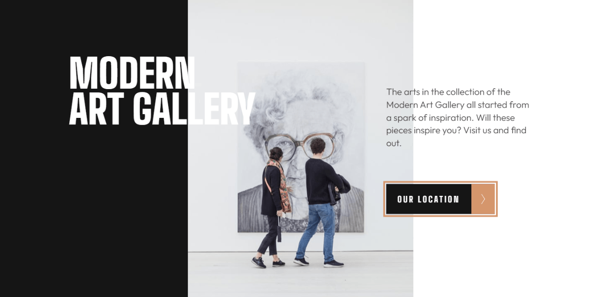

# 🚀 Art gallery website

Responsive art gallery website built with semantic HTML and modern CSS.  
Focused on clean structure, accessibility, and a mobile-first workflow.

This is a solution to the [Art gallery website challenge on Frontend Mentor](https://www.frontendmentor.io/challenges/art-gallery-website-yVdrZlxyA).

---

## 🔗 Links

- 🌎 [Live site](https://vimpdev.github.io/fem-junior-htmlcss-05-art-gallery-website/)
- 📌 [Frontend Mentor solution](https://www.frontendmentor.io/solutions/art-gallery-website-mobile-first-css-layer-responsive-layout-dtJDxENEtE)

---

## 🎬 Demo

---

## 📸 Screenshots

| 📱 Mobile - Index | 📱 Mobile - Location |
| --- | --- |
|  |  |

| 📲 Tablet - Index | 📲 Tablet - Location |
| --- | --- |
|  |  |

| 🖥️ Desktop - Index | 🖱️ Hover | ⌨️ Focus |
| --- | --- | --- |
|  |  |  |

| 🖥️ Desktop - Location | 🖱️ Hover | ⌨️ Focus |
| --- | --- | --- |
|  |  |  |

---

## 🛠️ Built with

- Semantic HTML5
- Modern CSS (custom properties, nesting, layers)
- Flexbox & Grid
- Mobile-first workflow
- Accessible focus states

---

## 💡 Key features

- Responsive layout for mobile, tablet and desktop
- Reusable layout utilities (`stack`, `cluster`)
- CSS architecture using `@layer`
- Interactive states (`hover` and `focus-visible`)
- Page-specific styling using `data-*` attributes
- SEO and social meta tags (Open Graph & Twitter)

---

## 📚 What I learned

- Structuring scalable CSS using `@layer`
- Applying mobile-first design properly
- Handling responsive typography and layout shifts
- Improving accessibility with `focus-visible`
- Writing cleaner and more semantic HTML

---

## 🤖 AI Collaboration

I used AI tools for learning and validating:
- clarify CSS concepts and layout decisions
- review accessibility and semantic structure
- refine naming and code organization

---

## 👩‍💻 Author

- Frontend Mentor – [@vimpdev](https://www.frontendmentor.io/profile/vimpdev)

---